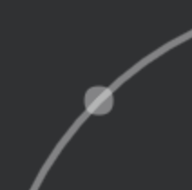
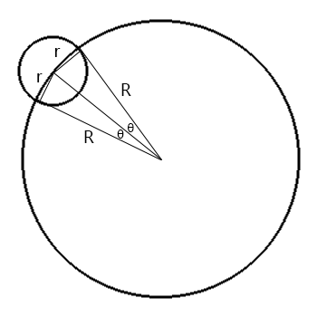

# 一个动画
## 先看效果

[纯动画效果](https://qishaoxuan.github.io/rhythm-ripple/)

[带音乐特效，仅支持谷歌浏览器](https://qishaoxuan.github.io/rhythm-ripple/rhythm.html)

[代码在此](https://github.com/QiShaoXuan/rhythm-disk)

## 简单？我们可能不缺少发现简单的眼睛，但缺少完美简单的手

这个动画效果是在网易云音乐 app 上看到的，抱着复习 canvas 的心态来实现。

现在开始分析并且实现所需要的功能

## 列出需求

1. 效果参照已实现的上方链接。
2. 针对不同使用场景需要可定制参数（大小，颜色等）
3. 需要根据音乐节奏快慢进行动画

## 开始实现

### 1. 参数设置

根据效果，我们能初步想到的需要设置的参数如下，参数的具体值可以在随后实现中进一步修改

```js
 const originParams = {
  cover: '',   // 中心的封面图
  size: 500,  // 画布 canvas 的尺寸
  radius: 100,  // 封面图，中心圆的半径，小于零则为容器的百分比
  interval: [500, 1500],  // 涟漪出现的最小频率（毫秒）
  centerColor: '#ddd',  // 封面图位置的颜色（在没有封面图时显示）
  borderWidth: 5,  //  封面图边框的宽度
  borderColor: '#aaa',  // 封面图边框的颜色
  rippleWidth: 4,  // 涟漪圆环的宽度
  rippleColor: '#fff',  // 涟漪颜色
  pointRadius: 8,  // 涟漪圆点的半径
  rotateAngle: .3, // 封面图每帧旋转的角度
}
```

### 2. 编写构造函数

我们知道，动画的原理，就是趁脑子不注意反应不过来的时候偷偷换上一副差不多的画面，这样一步一步的替换，就形成了动画，而这一步一步就可以叫做`帧`。

所以，在渲染圆圈及圆点时，我们需要一个数组来存储他们每一次渲染的位置。

另外，我们需要一些必要的初始化判断，以及声明一些公共的参数

综上，我们可以基本写出如下的构造函数

```js
class Ripple {
  constructor(container, params = {}) {
    const originParams = {
      cover: '',
      size: 500, 
      radius: 100, 
      interval: [500, 1500], 
      centerColor: '#ddd', 
      borderWidth: 5, 
      borderColor: '#aaa', 
      rippleWidth: 4, 
      rippleColor: '#fff', 
      pointRadius: 8, 
      rotateAngle: .3, 
    }

    this.container = typeof container === "string" ? document.querySelector(container) : container

    this.params = Object.assign(originParams, params)

    this.cover = this.params.cover

    this.radius = this.params.radius < 1 ? this.params.size * this.params.radius : this.params.radius

    this.center = this.params.size / 2  // 中心点

    this.rate = 0  // 记录播放的帧数
    this.frame = null  // 帧动画，用于取消
    this.rippleLines = []  // 存储涟漪圆环的半径
    this.ripplePoints = []  // 存储涟漪点距离中心点的距离
  }
}
```

### 3. 初始化容器 

canvas 中图片渲染且旋转并不容易，所以在 `cover` 参数传值时，通过 `img` 标签来渲染。

另外的，我们需要一些其他必要的 CSS 添加在元素上

```js
  class Ripple{
    initCanvas() {
      this.container.innerHTML = `<canvas width="${this.params.size}" height="${this.params.size}"></canvas>${this.cover ? `` : ''}`
  
      this.cover = this.container.querySelector('img')
      this.canvas = this.container.querySelector('canvas')
      this.ctx = this.canvas.getContext('2d')
  
      this.rotate = 0
  
      const containerStyle = { ... }
      const canvasStyle = { ... }
      const coverStyle = { ... }
  
      utils.addStyles(this.container, containerStyle)
      utils.addStyles(this.canvas, canvasStyle)
      utils.addStyles(this.cover, coverStyle)
  
      this.strokeBorder()
    }
  }
```

### 4. 画个圆

canvas 的基本用法，就不多赘述了

```js
class Ripple{
  strokeCenterCircle() {
    const ctx = this.ctx
    ctx.beginPath()
    ctx.arc(this.center, this.center, this.radius, 0, 2 * Math.PI)
    ctx.closePath()
    ctx.fillStyle = this.params.centerColor
    ctx.fill()
   }
  strokeBorder() {
    const ctx = this.ctx
    ctx.beginPath()
    ctx.arc(this.center, this.center, this.radius + this.params.borderWidth / 2, 0, 2 * Math.PI)
    ctx.closePath()
    ctx.strokeStyle = this.params.borderColor
    ctx.lineWidth = 5
    ctx.stroke()
  }
}
```

### 5. 画个圈圈

这不就是一个圈加一个圆吗

```js
    class Ripple{
      drawRipple() {
        const ctx = this.ctx
  
        // 画外圈
        ctx.beginPath()
        ctx.arc(this.center, this.center, 200, 0, Math.PI * 2)
        ctx.strokeStyle = 'rgba(255,255,255,0.4)'
        ctx.lineWidth = this.params.rippleWidth
        ctx.stroke()
  
        // 画点
        ctx.beginPath()
        ctx.arc(this.center - 200/Math.sqrt(2), this.center - 200/Math.sqrt(2), this.params.pointRadius, 0, 2 * Math.PI)
        ctx.closePath()
        ctx.fillStyle = 'rgba(255,255,255,0.4)'
        ctx.fill()
      }
    }
```

于是出现了下面的问题



出现的原因也很简单，两个半透明的图形的重合部分透明度肯定是会加重的，所以只能通过画一个不完整的圆圈（正好把圆点的部分隔过去）来解决了，解决方式如下图：



为了容易看到，连线略微向内移动了一点，所以我们的问题就是已知 r、R，求角度 θ，解答就不做详解啦，算是高中数学的应用。我们可以得到角度为 `Math.asin(R / r / 2) * 4`。

### 6. 继续画圈圈

圆环和圆点的重合已经解决了，现在需要的是在每次刷新时更新他们的位置，如果达到了条件，则需要新添加一个圆环和点，如果圆环的半径超出了画布，则删掉对应的数据

```js
  class Ripple{
    strokeRipple() {
      // 当圆环大小超出画布时，删除改圆环数据
      if (this.rippleLines[0] > this.params.size) {
        this.rippleLines.shift()
        this.ripplePoints.shift()
      }
  
      // 当达到条件时，添加数据
      if (this.rate - this.lastripple >= this.minInterval) {
        this.rippleLines.push({
          r: this.radius + this.params.borderWidth + this.params.rippleWidth / 2,
          color: utils.getRgbColor(this.params.rippleColor)
        })
  
        this.ripplePoints.push({
          angle: utils.randomAngle()
        })
        // 更新添加时间
        this.lastripple = this.rate
      }
  
      // 计算下一次渲染的位置数据
      this.rippleLines = this.rippleLines.map((line, index) => ...)
  
      this.ripplePoints = this.rippleLines.map((line, index) => ...)
  
      // 根据新的数据渲染
      this.strokeRippleLine()
      this.strokeRipplePoint()
    }
  }
```

### 6. 开始动画

每渲染一次即更新一次数据，将 `requestAnimationFrame` 存储于 `this.frame` 中，方便取消。

```js
class Ripple{
    animate() {
      this.ctx.clearRect(0, 0, this.params.size, this.params.size)
  
      this.strokeRipple()
  
      this.strokeBorder()
  
      ...
  
      var that = this
      this.frame = requestAnimationFrame(function () {
        that.animate()
      })
    }
}
```

### 7. 添加音乐节奏

原理如下：

1. 创建一个 <audio>，做好相关设置（自动播放、控件显示等等）
2. 创建一个 AudioContext，将音频来源设置为这个 <audio>
3. 创建一个 AnalyserNode，将 AnalyserNode 与 AudioContext 的音频来源链接起来
4. 如果需要达到一边播放一遍显示的效果，需要将 Analyser 再连出 AudioContext，否则数据只进不出没有声音
5. 创建一个可以绘制的地方（可以是普通的 HTML元素，或者 canvas，SVG，WebGL等等）
6. 定时从 AnalyserNode 获取音频数据（可以是时间域或频率域的数据，定时可以用 requestAnimationFrame 或者是 setTimeout 来做）
7. 利用获取到的数据，进行可视化设计，绘制图像

但是，可能是 `audiocontext` 的兼容问题，在 safari 中，无法实时获取到音频信息，如果有大神知晓，望不吝赐教。

所以这部分的实现并没有什么好讲的了，有兴趣的可以直接查看 [源码](https://github.com/QiShaoXuan/rhythm-ripple/blob/master/src/rhythmRipple.js) 及 [实现](https://qishaoxuan.github.io/rhythm-ripple/rhythm.html)

## 写在最后

上述动画的实现的确并不复杂，但是在实现的过程中，可能考虑到的更多的是如何组织代码，如何设计接口（怎么方便使用，增加定制度，减少操作度）。这些东西在写上面教程的时候轻猫淡写，一笔带过或者压根没提过，但只有在自己写时才能体会到切实的需要，所以，如果你能看到这里，不妨放下刚才看到的代码实现，只看效果，自己也来写一个（带音乐的）这样的动画，毕竟，我们不缺少发现简单的眼睛，缺少的可能是完美简单的手。


## 一些其他项目

我觉得挺好但好像并没人知道...

[css tricks](https://qishaoxuan.github.io/css_tricks/)

[js tricks](https://qishaoxuan.github.io/js_tricks/)

[animate_resume](https://github.com/QiShaoXuan/animate_resume_ts)

## 参考

> https://developer.mozilla.org/en-US/docs/Web/API/Web_Audio_API/Visualizations_with_Web_Audio_API

> https://developer.mozilla.org/zh-CN/docs/Web/Guide/Events/Media_events
